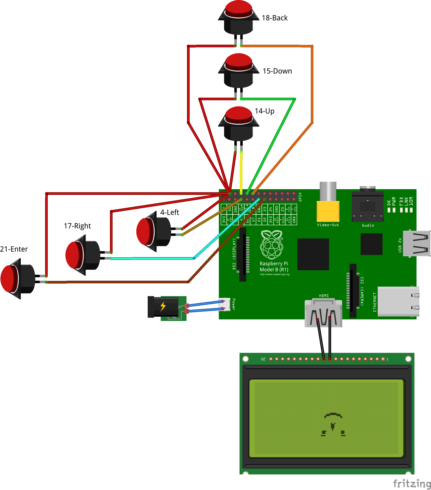
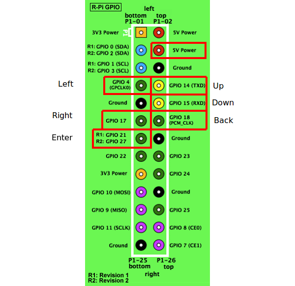

# Kodi-Monitor
Kodi + Raspberry Pi + switches = fun

## 5 inch HDMI LCD Screen Installation
Based on instructions at:
* https://www.waveshare.com/wiki/5inch_HDMI_LCD
* https://github.com/waveshare/LCD-show
* https://www.raspberrypi.org/forums/viewtopic.php?t=223926


* edit `/boot/config.txt` and add the following lines:

  ```
  max_usb_current=1
  hdmi_group=2
  hdmi_mode=87
  hdmi_cvt 800 480 60 6 0 0 0
  hdmi_drive=1
  hdmi_force_hotplug=1
  gpu_mem=128
  ```

## Install Kodi in Raspberry Pi OS Buster
Based on instructions at:
* https://www.raspberrypi.org/forums/viewtopic.php?t=251645


* install Kodi
  * `$ sudo apt install kodi`
* add Kodi user to appropriate groups
  * `$ sudo usermod -a -G audio,video,input,dialout,plugdev,netdev,users,cdrom,tty,gpio kodi`
* auto-start Kodi at boot
  * edit/create `/lib/systemd/system/kodi.service`
  
  ```
  [Unit]
  Description = Kodi Media Center
  After = remote-fs.target network-online.target
  Wants = network-online.target

  [Service]
  User = kodi
  Group = kodi
  Type = simple
  ExecStart = /usr/bin/kodi-standalone
  Restart = on-abort
  RestartSec = 5

  [Install]
  WantedBy = multi-user.target
  ```
* enable service
  * `$ sudo systemctl enable kodi.service`
* install Python GPIO library
  * `$ sudo apt install python3-gpiozero`

## Wire up switches



## Install Kodi-Monitor
* edit `/etc/rc.local` and add the following lines:

  `/home/kodi/Kodi-Monitor/kodiMonitor.py &`

