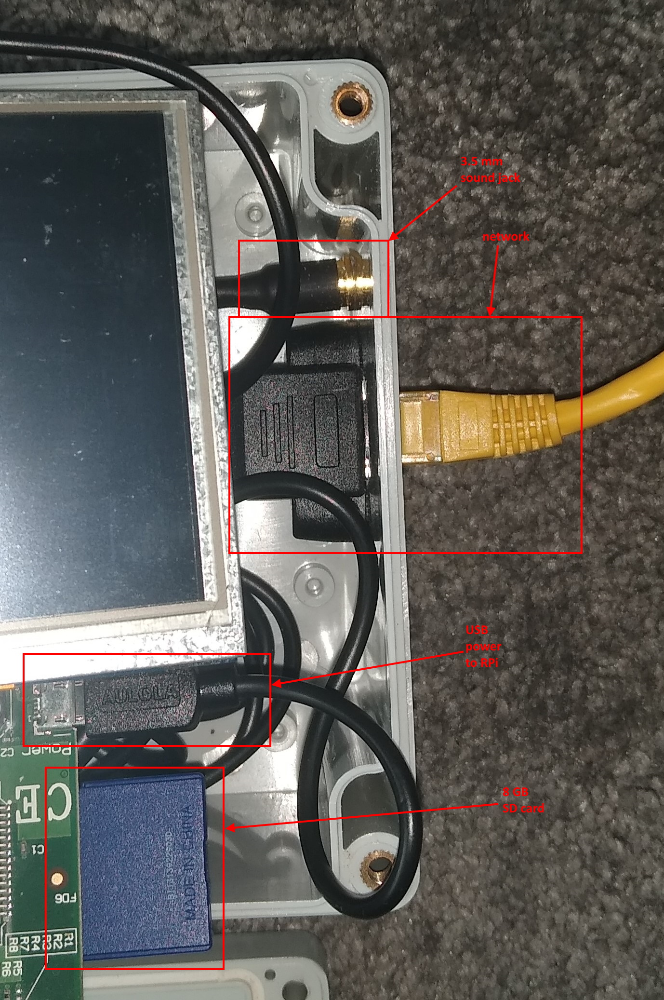

# Kodi-Monitor
Kodi + Raspberry Pi + screen + switches = fun

<p />
<p />
<p />
<p />


## Install Waveshare 5 inch HDMI LCD Screen
Based on instructions at:
* https://www.waveshare.com/wiki/5inch_HDMI_LCD
* https://github.com/waveshare/LCD-show
* https://www.raspberrypi.org/forums/viewtopic.php?t=223926


* edit `/boot/config.txt` and add the following lines:

  ```
  max_usb_current=1
  hdmi_group=2
  hdmi_mode=87
  hdmi_cvt 800 480 60 6 0 0 0
  hdmi_drive=1
  hdmi_force_hotplug=1
  gpu_mem=128
  ```

## Install Kodi in Raspberry Pi OS Buster
Based on instructions at:
* https://www.raspberrypi.org/forums/viewtopic.php?t=251645


* install Kodi
  * `$ sudo apt install kodi`
* add Kodi user to appropriate groups
  * `$ sudo usermod -a -G audio,video,input,dialout,plugdev,netdev,users,cdrom,tty,gpio kodi`
* auto-start Kodi at boot
  * edit/create `/lib/systemd/system/kodi.service`
  
  ```
  [Unit]
  Description = Kodi Media Center
  After = remote-fs.target network-online.target
  Wants = network-online.target

  [Service]
  User = kodi
  Group = kodi
  Type = simple
  ExecStart = /usr/bin/kodi-standalone
  Restart = on-abort
  RestartSec = 5

  [Install]
  WantedBy = multi-user.target
  ```
* enable service
  * `$ sudo systemctl enable kodi.service`
* install Python GPIO library
  * `$ sudo apt install python3-gpiozero`

## Enable USB Sound Card As Default
1. Disable onboard audio
  1. open `/etc/modprobe.d/raspi-blacklist.conf`
  1. add `blacklist snd_bcm2835`

1. Setup sound device alias
  1. open `/lib/modprobe.d/aliases.conf`
  1. comment out line `options snd-usb-audio index=-2`
  
  That line overrides the `/etc/modprobe.d/` files
  
  ```
  # These are the standard aliases and dependencies.
  # This file does not need to be modified.

  # prevent unusual drivers from appearing as the first sound device ###########
  options snd-pcsp index=-2
  #options snd-usb-audio index=-2
  options cx88_alsa index=-2
  options snd-atiixp-modem index=-2
  options snd-intel8x0m index=-2
  options snd-via82xx-modem index=-2

  # work around other kernel issues ############################################
  # The EHCI driver should be loaded before the ones for low speed controllers
  # or some devices may be confused when they are disconnected and reconnected.
  softdep uhci-hcd pre: ehci-hcd
  softdep ohci-hcd pre: ehci-hcd
  ```

## Wire Up Switches
### Determine which model of Raspberry Pi we have
`$ cat /sys/firmware/devicetree/base/model`
```
Raspberry Pi Model B Rev 1
```
`$ cat /sys/devices/system/cpu/cpu0/cpufreq/scaling_cur_freq`
```
700000
```
`$ free -h`
```
              total        used        free      shared  buff/cache   available
Mem:          115Mi        18Mi        86Mi       0.0Ki        10Mi        67Mi
Swap:          99Mi        15Mi        84Mi
```
Wow!  This is one of the original ones.  With only 256MB RAM (half allocated to the GPU)
and running at a puny 700Mhz, this *really* struggles to keep up with Kodi.

### Pinout diagram
`$ pinout`

```
+------------------| |--| |------+
| ooooooooooooo P1 |C|  |A|      |
| 1oooooooooooo    +-+  +-+      |
|                                |
|                +---+          +====
|                |SoC|          | USB
|   |D| Pi Model +---+          +====
|   |S| B  V1.0                  |
|   |I|                  |C|+======
|                        |S||   Net
|                        |I|+======
=pwr             |HDMI|          |
+----------------|    |----------+

Revision           : 0002
SoC                : BCM2835
RAM                : 256Mb
Storage            : SD
USB ports          : 2 (excluding power)
Ethernet ports     : 1
Wi-fi              : False
Bluetooth          : False
Camera ports (CSI) : 1
Display ports (DSI): 1

P1:
   3V3  (1) (2)  5V
 GPIO0  (3) (4)  5V
 GPIO1  (5) (6)  GND
 GPIO4  (7) (8)  GPIO14
   GND  (9) (10) GPIO15
GPIO17 (11) (12) GPIO18
GPIO21 (13) (14) GND
GPIO22 (15) (16) GPIO23
   3V3 (17) (18) GPIO24
GPIO10 (19) (20) GND
 GPIO9 (21) (22) GPIO25
GPIO11 (23) (24) GPIO8
   GND (25) (26) GPIO7
```

**NOTE:  GPIO21 maps to physical pin 13 for Rev1 boards**


### Circuit diagram


## Install Kodi-Monitor
* edit `/etc/rc.local` and add the following lines:

  ```
  export KODI_USER_NAME=kodi
  export KODI_PASSWORD=<your-KODI_PASSWORD-here>
  export KODI_HOST=localhost
  export KODI_PORT=8080
  /home/kodi/Kodi-Monitor/kodiMonitor.py &
  ```

